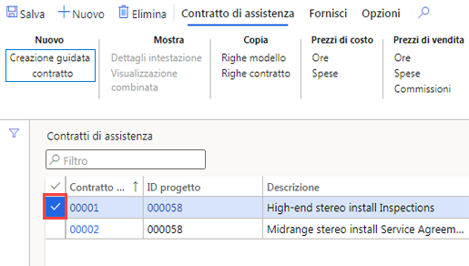
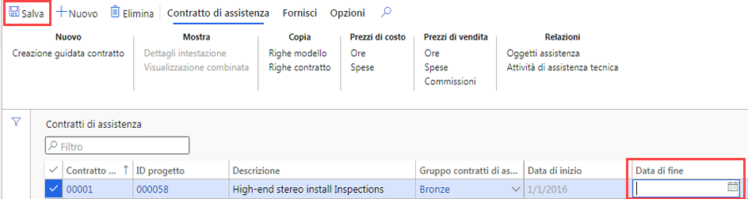

---
lab:
    title: 'Lab 7: Creare un ordine di lavoro pianificato'
    module: 'Modulo 1: Concetti fondamentali su Microsoft Dynamics 365 Supply Chain Management'
---

## Lab 7: Creare un ordine di lavoro pianificato

## Obiettivi

Gli ordini di manutenzione inseriti nel sistema descrivono la manutenzione o la riparazione necessaria per un cespite e vengono usati per assegnare le risorse appropriate per completare la richiesta di manutenzione. La società ha un contratto di assistenza in corso e deve assicurarsi che vengano creati ordini di assistenza pianificati per ottenere l'assistenza prevista per gli articoli inclusi nel contratto.

## Configurazione del lab

   - **Tempo stimato**: 10 minuti

## Istruzioni

1. Nella home page Finance and Operations, in alto a destra, verificare di lavorare con la società USMF.

1. Se necessario, selezionare la società e scegliere **USMF** dal menu.

1. Nel pannello di navigazione a sinistra selezionare **Moduli** > **Gestione assistenza** > **Contratti di assistenza** > **Contratti di assistenza**.

1. Selezionare la casella di controllo nella prima colonna del primo contratto di assistenza.

    

1. Selezionare la casella **Data di fine**, eliminare il valore corrente e quindi nel menu in alto selezionare **Salva**.  
 La data di fine verrà rimossa in modo che sia possibile creare un nuovo ordine di assistenza per il contratto.

    

1. Nel menu in alto selezionare **Consegna**.

1. Sulla barra multifunzione in **Crea** selezionare **Ordini di assistenza pianificati**.

1. Nel riquadro Crea ordini di assistenza, in **PERIODO** impostare **Dal** sulla data corrente e **Al** due giorni dopo la data corrente.

1. In **REGISTRO INFORMAZIONI** selezionare l'interruttore **Mostra Registro informazioni** per impostarlo su **Sì**.  
Verrà visualizzato un elenco degli ordini di assistenza creati nel contratto.

1. In **INCLUDI TIPI DI TRANSAZIONI** selezionare l'interruttore **Ora** per impostarlo su **Sì**.  
I tipi di transazione rappresentano le righe create nel contratto di assistenza e ogni tipo di transazione selezionato genera diversi ordini di assistenza, a seconda dell'intervallo di assistenza specificato nella riga del contratto di assistenza.

1. In **OPZIONE** selezionare l'interruttore **Continua** per impostarlo su **Sì**.  
Questa opzione consente di creare gli ordini di assistenza mancanti di una serie continua di ordini di assistenza.

1. Selezionare **OK**.
